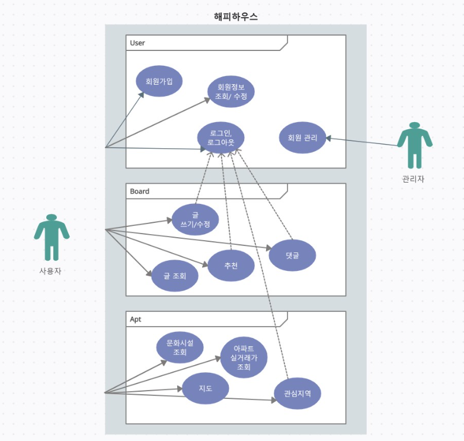
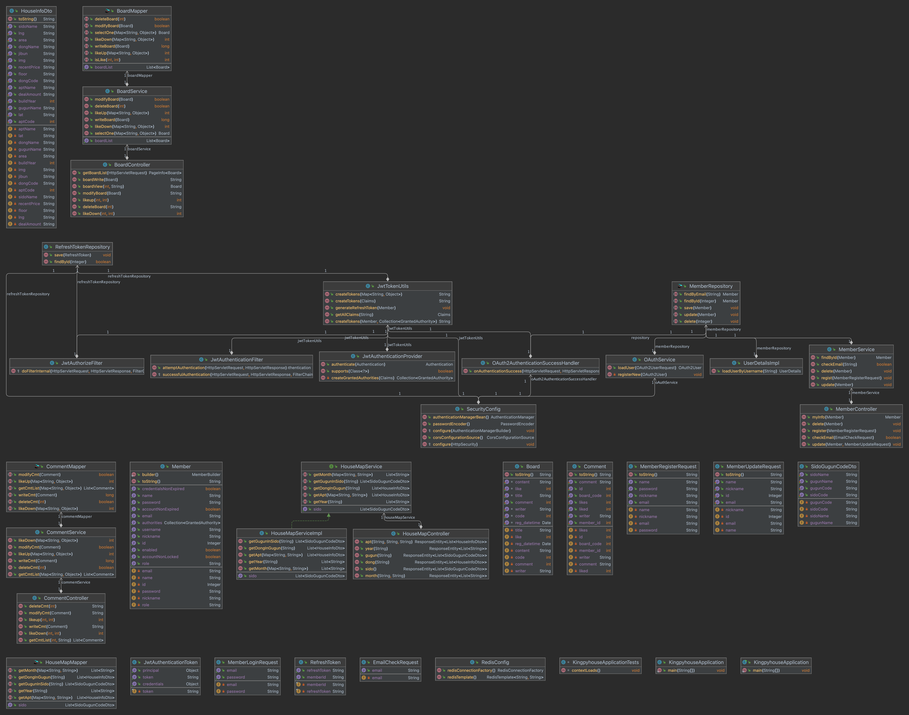
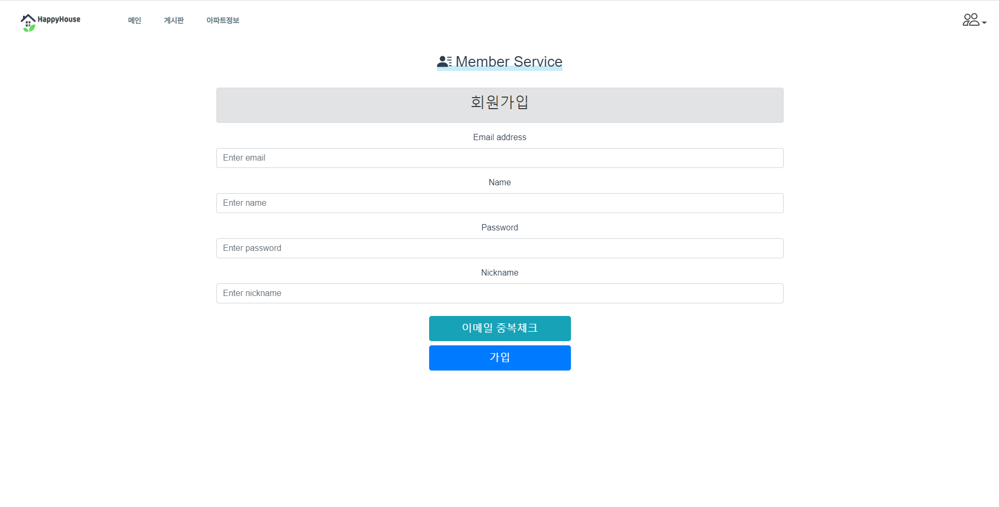
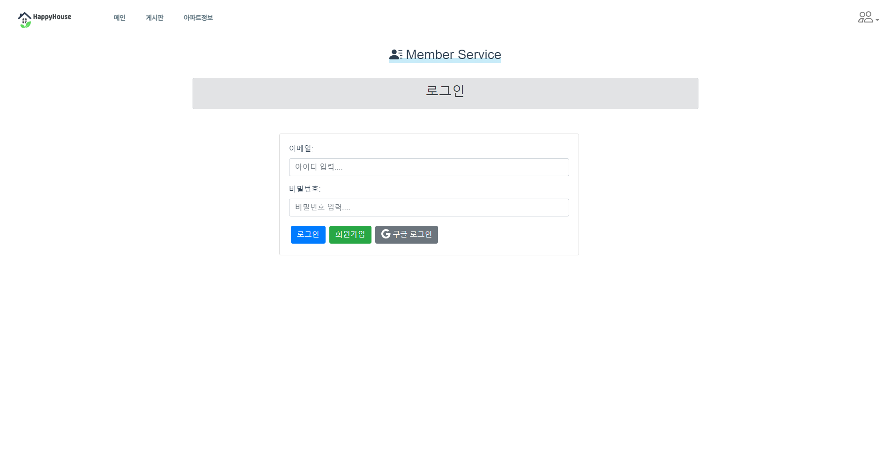
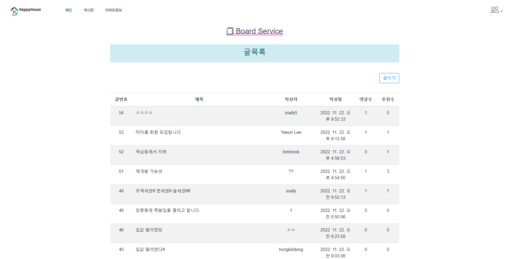
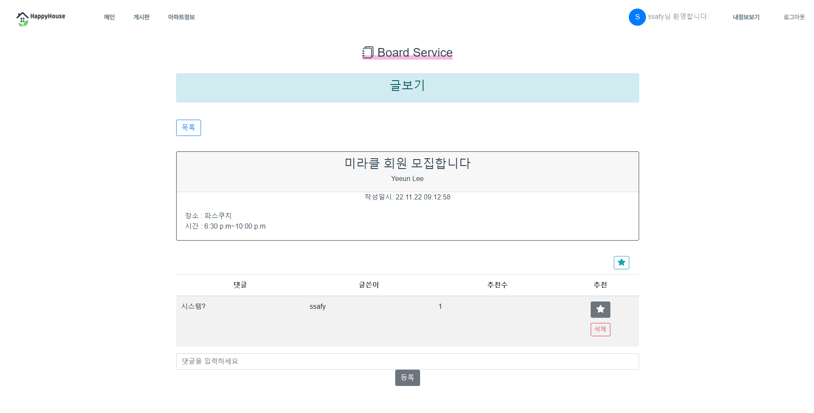
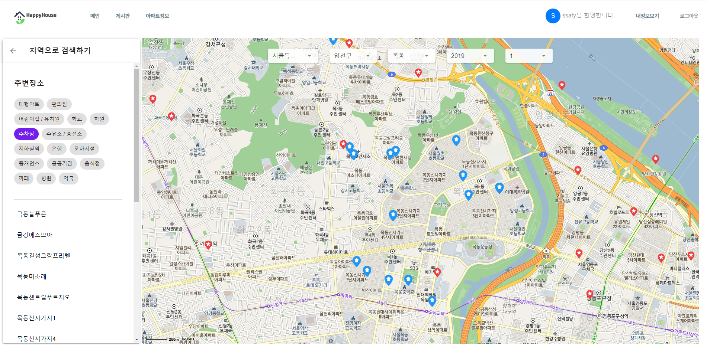
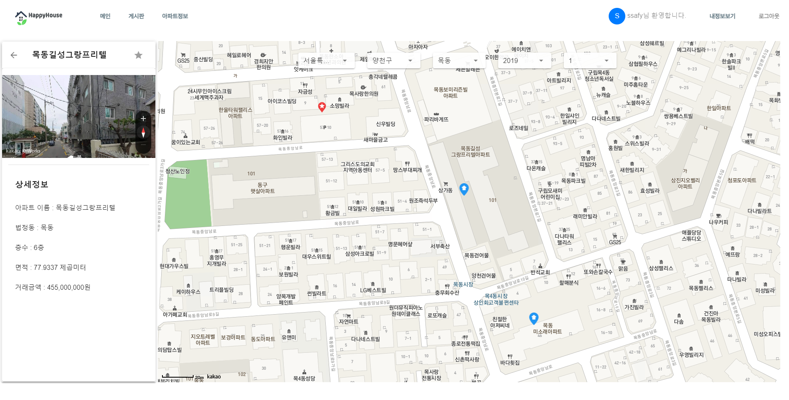

# SSAFY 프로젝트 최종 보고서

# 주택 실거래가 확인 Web 페이지 설계 및 구현

### [ Where is My Home ]

삼성 청년 아카데미 8기 서울 19반 4조

최태규 | 양주연 | 남이랑

# 목차

### I  개요

- 프로젝트 개요
- 가상고객 설정

### II  프로젝트 설계

- 요구사항 정의
- 요구사항 및 기능 세부분석
- 화면설계서
- DB 설계
- Class Diagram 설계

### III 웹페이지 구현

- 구현 페이지

### IV 결과물 및 최종 결론

- Database다이어그램
- Back-end 클래스 다이어그램

# 1. 개요

### ◎ 프로젝트 개요

### □ 프로젝트 개요

| 구분          | 내용                                                                                                               |
| ------------- | ------------------------------------------------------------------------------------------------------------------ |
| 프로젝트명    | SSAFY - Where is My Home                                                                                           |
| 프로젝트 내용 | 주택을 구하는 고객의 요구에 맞추어, 기간별 주택 실거래가 내역을 검색하고 부가기능을 제공할 수 있는 웹사이트를 제작 |
| 프로젝트 일정 | 2022-11-17 ~ 2022-11-24                                                                                            |
| 담당 팀원     | 최태규 - 회원관리 기능, 보안 기능, 공통                                                                            |
|               | 양주연 - 주택 실거래가 기능                                                                                        |
|               | 남이랑 - 게시판 기능                                                                                               |

### ◎ 가상고객 설정

- 생애 첫 아파트 매매를 준비하는 1인 가족, 신혼부부

- 아파트 매매를 원하고, 기존의 매매 내역과 시세를 알고 싶은 사람

- 원하는 관심매물을 설정하고 주변 편의시설을 확인할 수 있게 요청

- 비슷한 상황의 유저들과도 게시판으로 소통하여 정보를 얻을 수 있게 함

- 개인정보 보호를 위해 기본적인 수준의 보안성을 요청

# 2. 프로젝트 설계

### ◎ 요구사항 정의

### □ 기능적 요구사항

| 주택 실거래가 기능 | 주택 실거래가 검색             | 실거래가 데이터 가공 후 DB 저장, 위치에 따른 검색 결과 제공         |
| ------------------ | ------------------------------ | ------------------------------------------------------------------- |
|                    | 검색된 매물 로드맵 제공        | 카카오맵 API를 이용해서 해당 매물의 사진 제공                    |
|                    | 매물 위치 지도 제공            | 매물의 위치를 지도 상에 표시해서 제공                               |
|                    | 관심 매물 등록                 | 내가 관심 있는 매물을 즐겨찾기로 등록 및 삭제 가능                  |
|                    | 주변시설 검색                  | 카카오맵 API                                                        |
| 회원관리 기능      | 로그인/로그아웃                | DB에 유저 정보가 있는지 확인 후 로그인 / 로그아웃                   |
|                    | 회원정보 가입, 수정, 탈퇴      | 회원정보 가입, 수정, 탈퇴                                           |
|                    | 비밀번호 암호화 사용           | Bcrypt를 사용해 비밀번호 암호화                                     |
|                    | OAuth 로그인(구글 간편 로그인) | 로그인 API를 이용해서 로그인 / 로그아웃                             |
| 게시판 기능        | 게시판 기능 제공               | 게시판 목록, 글쓰기, 상세 보기, 글 작성, 글 삭제, 글 수정 기능 제공 |
|                    | 댓글                           | 게시글마다 댓글 작성, 수정, 삭제 가능                               |
|                    | 글, 댓글 추천                  | 글과 댓글에 인당 1번씩 추천 가능                                    |
| 보안 기능          | 2차 인증                       | 회원정보, 글 등의 수정 삭제 시 confirm을 통해 사용자 의사 재확인    |
|                    | CSRF 방어                      | 글 작성 시 CSRF 토큰을 통해 해킹 방어                               |
|                    | Reflected XSS 방어             | 네이버 lucy 필터를 사용해 해킹 방어                                 |
|                    | https                          | https로 전환하여 보안 강화                                          |
| 공통               | AWS 배포                       | AWS로 배포                                                          |
|                    | 로드 밸런싱                    | AWS nginx를 통한 로드밸런싱                                         |
|                    | 무중단 배포                    | Jenkins를 이용한 무중단 배포                                        |
|                    | 로그                           | Spring AOP를 통해 로그 관리                                         |
|                    | 사용자 인증                    | JWT를 이용한 사용자 인증                                            |

□ 비기능적 요구사항

| #   | 요구사항명          | 요구사항 상세                         |
| --- | ------------------- | ------------------------------------- |
| 1   | 공공데이터의 정확성 | API로 가져온 데이터의 정확성 체크     |
| 2   | 가용성              | 언제나 서비스 가능해야 함             |
| 3   | 응답성              | 검색에 대한 결과를 빠르게 응답해야 함 |
| 4   | 사용자 편의성       | 사전 지식 없이도 쓰기 편해야 함       |

### ◎ 요구사항 세부분석

### □ UseCase

### ◎ DB ERR Diagram

### ◎ Backend Class Diagram

# 3. 구현

메인페이지

로그인/회원가입

.png>)

게시판

아파트 실거래 매매 조회

.png>)

